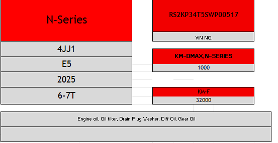
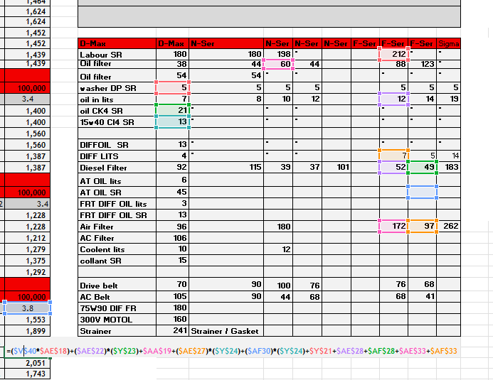
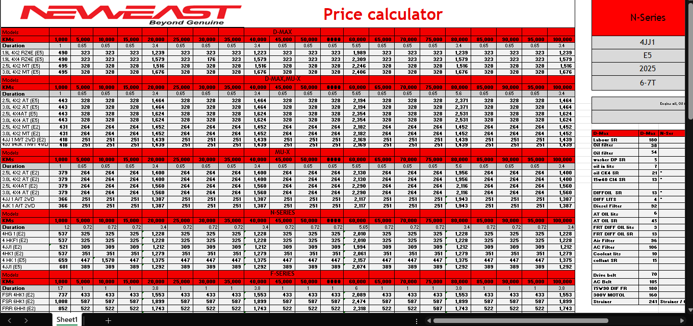

# Car Maintenance Calculator (Excel)

This interactive Excel tool calculates required maintenance for vehicles based on:
- Vehicle VIN number
- Mileage input

Features:
- Shows vehicle specifications and required maintenance
- Calculates costs for oil and parts (adjustable)
- Highlights key calculations using conditional formatting
- Built with Excel formulas: XLOOKUP, IF, MID, OR

Screenshots:

**Note:** Prices are editable and for demonstration purposes.
